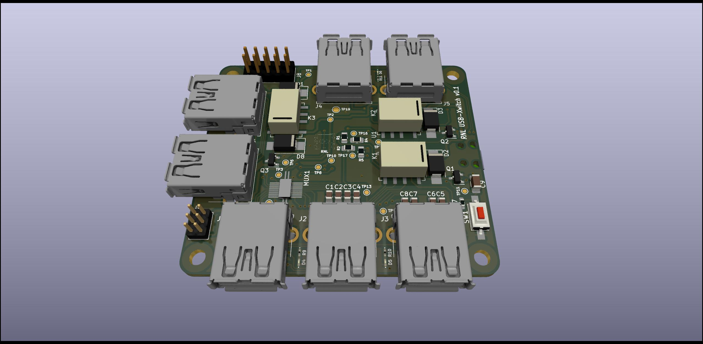

# usb-xwitch
A programmable budget usb 1:2 multiplexer and power cycle device. Features 1x 1:2 usb switch + 2x usb power cycle up to 5Gbps. Controlling via on board micro USB or by Raspberry Pi. 

1. Channel Features

- ChA: USB 3.0 High Speed 1 Mux 2 switching. Additional physical control by push button switch.
- ChB: USB 3.0 High Speed BUS power cycle.
- ChC: USB 3.0 High Speed BUS power cycle.

2. Command via micro USB serial (default) or use by UART from Raspberry Pi (as a HAT)

## Hardware Overview

- ChA (lower side 3 USBs): USB3.0 1 mux 2. Port active indications. Switch button
- ChB (upper side 2 USBs): USB3.0 bus power cycle by relay. VBus LED indication.
- ChC (left side 2 USBs): USB3.0 bus power cycle by relay. VBus LED indication.
- Raspberry Pi compaticable header (10 Pins).
- Mountable as Raspberry Pi 2/3/4 HAT.

## Software Overview

- pico software
- USB control protocols and commands
- UART control commands
